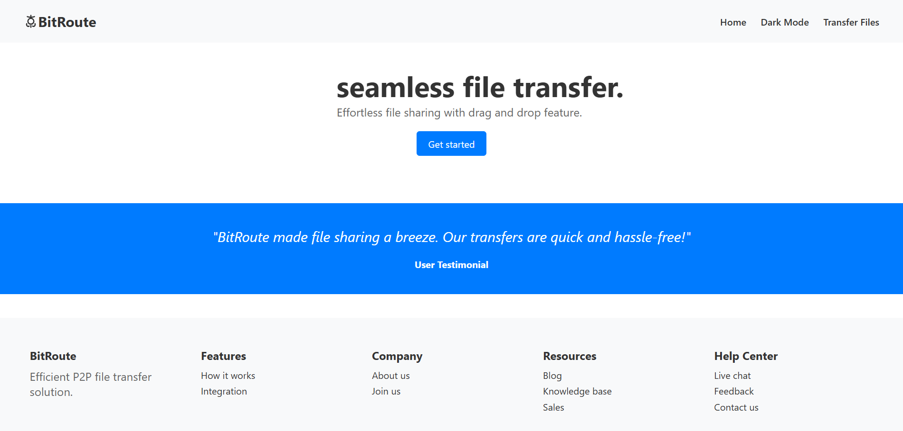
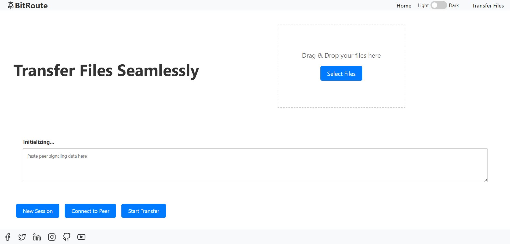

# 📡 P2P File Transfer via WebRTC

A peer-to-peer (P2P) file transfer web application built with **WebRTC**, enabling direct file sharing between two devices without a server intermediary for the file data. The app uses **Node.js** for signaling and **HTML/CSS** for the frontend. 

## 🚀 Features

- 🔁 **P2P File Transfer** – Direct transfer between devices using WebRTC DataChannels.
- 🆔 **Session ID Based Connection** – Sender generates a session ID, and the receiver enters it to connect.
- 🖱️ **Drag & Drop File Sharing** – Intuitive drag and drop interface for file uploads.
- 🔐 **End-to-End Encryption** – Ensures privacy and data protection during transfer.
- 💬 **Minimal Signaling Server** – Built with Node.js and Socket.IO for connection setup only.

## 🧰 Tech Stack

- **Frontend:** HTML,CSS
- **Backend:** Javascript+Socket.IO
- **Real-Time Communication:** WebRTC

## 📷 Demo

Here’s how the file transfer looks in action:





## 🛠️ How It Works

1. **Sender** opens the app and generates a session ID.
2. **Receiver** opens the app and enters the session ID (or scans QR).
3. A WebRTC connection is established using a signaling server.
4. Files are transferred directly using WebRTC DataChannels.

## ⚠️ Limitations
This project was developed during a 24-hour FOSS hackathon, and as such, there are a few limitations due to the restricted development time:

- 📂 **Single File Transfer Only** – Currently supports sending one file at a time.
- ❌ **No Transfer Resume** – Interrupted transfers cannot be resumed.
- 📶 **Unstable Connection on Poor Networks** – Performance may degrade on unstable or slow internet.

We plan to address many of these in future iterations or open it up for community contributions!


## 🧪 Running Locally

### 1. Clone the Repository
```bash
git clone https://github.com/your-username/webrtc-file-transfer.git
cd webrtc-file-transfer

